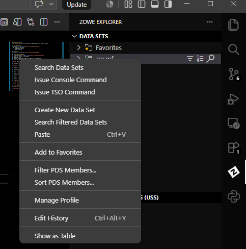

# COBOL Crash Course
> An English version of this course is available in the english branch

## Pré-requisitos
- Conta do [IBM Z Xplore](https://ibmzxplore.ibm.com)
- VS Code e as extensões
    - IBM Z Open Editor
    - Zowe Explorer

## Materiais
[Link dos slides](https://canva.link/7yzqcxkkvk8zg2x)

> Substitua o ZXXXX pelo seu ID

## Preparando o Ambiente
1. Crie sua conta no [IBM Z Xplore](https://ibmzxplore.ibm.com)
2. Anote seu usuário e sua senha
3. Abra o VS Code
4. Instale as extensões IBM Z Open Editor e Zowe Explorer
5. Vá na Aba do ZOWE Explorer

6. Clique no '+', em data sets

7. Selecione `Create Team Profile`

8. Crie uma profile global

9. Copie a configuração presente em config.json

10. Use a lupa para digitar seu usuário ZXXXX

11. Insira a sua senha e aperte enter

12. Espere alguns segundos

## Criando os datasets
1. Vá na Aba do ZOWE Explorer

2. Vá na lupa e digite o seu usuário (caso não tenha feito [Preparando o ambiente](#preparando-o-ambiente))

3. Clique com o botão direito em `zosmf` e em `Create New Data set`

### Criando Data Sets Sequenciais

4. Nomeie como ZXXXX.CBL

5. Utilize a opção `Data set Curso`

6. Repita o processo para ZXXXX.JCL

#### Caso falhe

1. Clique em Edit Attributes e adicione altere o seguinte
    - Allocation Unit: TRK
    - Directory Blocks: 1
    - Data set Type (DSNTYPE): LIBRARY

2. Clique em Save e nomeie como `Data set Curso`

3. Clique para salvar em User Space

### Criando Sequencial

1. Crie um dataset chamado ZXXXX.FILE

2. Selecione a opção `Seq Curso`

#### Caso falhe 

### Criando Dataset Particionado Binario 
1. Crie um data set chamado ZXXXX.LOAD

2. Selecione a opção `Part Binario`

